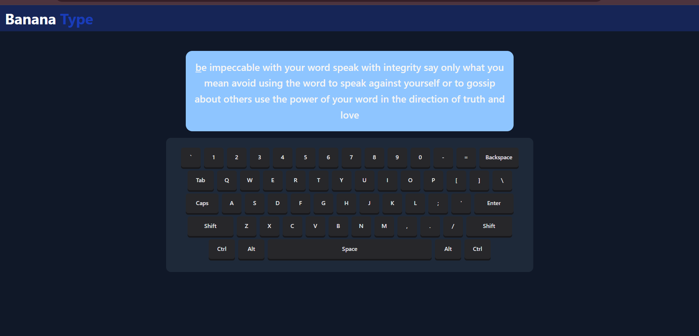

# Typing Test

A modern, responsive typing speed test application built with React, featuring real-time feedback, visual keyboard, and a sleek dark theme.



## ✨ Features

### Core Functionality
- **Real-time Typing Test**: Test your typing speed with randomly generated quotes
- **Live Feedback**: See your progress with color-coded text:
  - 🟢 **Green**: Correctly typed characters
  - 🔴 **Red**: Incorrectly typed characters
  - ⚪ **White**: Remaining text to type
  - 🔵 **Underlined**: Current typing position
- **Visual Keyboard**: Interactive on-screen keyboard that highlights pressed keys
- **Responsive Design**: Optimized for desktop, tablet, and mobile devices

### Technical Features
- **Modern React**: Built with React 19 and hooks
- **Fast API Integration**: Fetches quotes from [Quotable.io](https://quotable.io)
- **Dark Theme**: Consistent dark UI with blue accents
- **Smooth Animations**: CSS transitions and hover effects
- **Touch-Friendly**: Mobile-optimized keyboard interactions

## 🚀 Getting Started

### Prerequisites
- Node.js (version 16 or higher)
- npm or yarn package manager

### Installation

1. **Clone the repository**
   ```bash
   git clone <repository-url>
   cd typing-test
   ```

2. **Install dependencies**
   ```bash
   npm install
   ```

3. **Start the development server**
   ```bash
   npm run dev
   ```

4. **Open your browser**
   Navigate to `http://localhost:5173` to see the application running.


## 📁 Project Structure

```
typing-test/
├── srceenshots/
|   └──image.png
├── src/
│   ├── components/
│   │   ├── Keyboard.jsx      # keyboard component
│   │   ├── Navbar.jsx        # header
│   │   └── Phrase.jsx        # typing text
│   ├── pages/
│   │   └── Homepage.jsx      # application page
│   ├── App.jsx               # Root component
│   ├── index.css             
│   └── main.jsx               
├── index.html                
├── package.json               
├── vite.config.js            
├── eslint.config.js          
└── README.md                 
```

## 🛠️ Tech Stack

- **Frontend Framework**: React 19
- **Build Tool**: Vite
- **Styling**: Tailwind CSS 4
- **HTTP Client**: Axios
- **Linting**: ESLint
- **Language**: JavaScript (ES6+)

### Dependencies
- `react` & `react-dom`: Core React library
- `axios`: HTTP client for API requests
- `@tailwindcss/vite`: Tailwind CSS integration
- `tailwindcss`: Utility-first CSS framework


## 📱 Responsive Design

The application is fully responsive with breakpoints:
- **Mobile**: `< 640px` - Compact keyboard, smaller keys
- **Tablet**: `640px - 768px` - Medium-sized elements
- **Desktop**: `> 768px` - Full-sized keyboard and text


## 🤝 Contributing

1. Fork the repository
2. Create a feature branch (`git checkout -b feature/amazing-feature`)
3. Commit your changes (`git commit -m 'Add amazing feature'`)
4. Push to the branch (`git push origin feature/amazing-feature`)
5. Open a Pull Request

## 📄 License

This project is open source and available under the [MIT License](LICENSE).

## 🙏 Acknowledgments

- [Quotable.io](https://quotable.io) for providing the quote API
- [Tailwind CSS](https://tailwindcss.com) for the styling framework
- [React](https://reactjs.org) for the UI library
- [Vite](https://vitejs.dev) for the build tool

## 📞 Support

If you have any questions or issues, please open an issue on GitHub or contact the maintainers.

---

**Happy Typing!** 🎹✨

